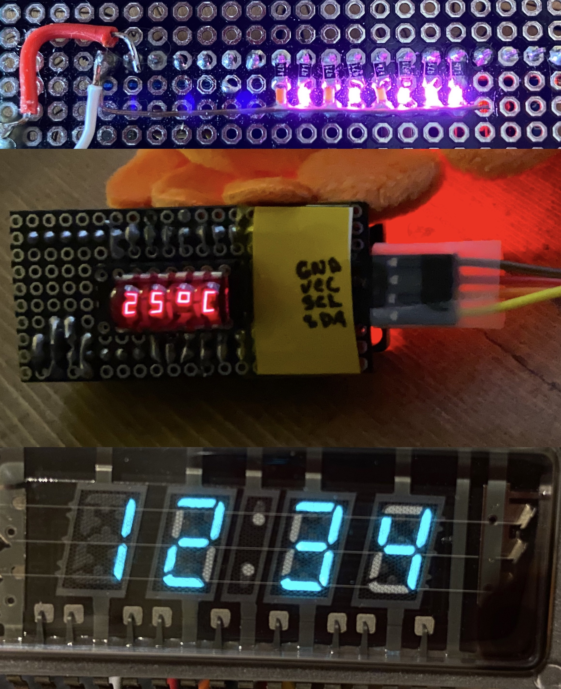

# Custom I²C Displays



Here are three examples of custom I²C displays written in Rust for the STM32F103 Microcontroller. These are commonly found on "Blue-Pill" development boards.

### Requirements 

- [Rust](https://rustup.rs/)
- [cargo embed and cargo flash](https://probe.rs/guide/1_tools/)
- Target support `rustup target install thumbv7m-none-eabi`

See the [stm32f1xx Quickstart Guide](https://github.com/stm32-rs/stm32f1xx-hal) for more details on the dev environment and flashing.

### Running the examples

Testing the LEDs:
```
cargo build --release --bin led-test
cargo flash --release --bin led-test --chip STM32F103C8
```

I²C LED Bar:
```
cargo build --release --bin i2c-leds
cargo flash --release --bin i2c-leds --chip STM32F103C8
cargo embed --release --bin led-test --chip STM32F103C8
```

7-Segment 4-Digit I²C Display:
```
cargo build --release --bin i2c-7-segment
cargo flash --release --bin i2c-7-segment --chip STM32F103C8
cargo embed --release --bin i2c-7-segment --chip STM32F103C8
```

4 Digit Vacuum Fluorescent Display over I²C:
```
cargo build --release --bin i2c-vfd`
cargo flash --release --bin i2c-vfd --chip STM32F103C8
cargo embed --release --bin i2c-vfd --chip STM32F103C8
```


### License

Licensed under either of

- Apache License, Version 2.0 ([LICENSE-APACHE](LICENSE-APACHE) or
  http://www.apache.org/licenses/LICENSE-2.0)
- MIT license ([LICENSE-MIT](LICENSE-MIT) or http://opensource.org/licenses/MIT)

at your option.

### Contribution

Unless you explicitly state otherwise, any contribution intentionally submitted
for inclusion in the work by you, as defined in the Apache-2.0 license, shall be
dual licensed as above, without any additional terms or conditions.
